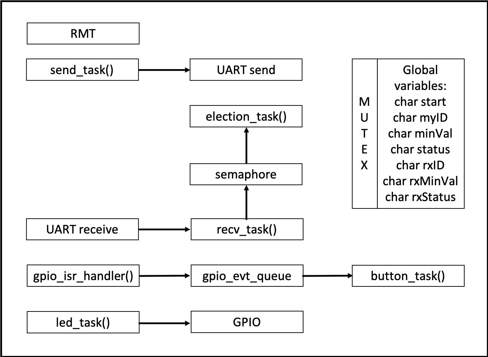

# IR Transceiver for Leader Election 

### Wiring:

Functionality      | Pin Mapping
------------       | -------------
RMT Pulse          | pin 26 -- A0
UART Transmitter   | pin 25 -- A1
UART Receiver      | pin 34 -- A2
Hardware interrupt | pin 4 - A5
Red LED            | pin 15
Green LED          | pin 32
Blue LED           | Pin 14

### Code Organization

5 concurrent tasks:
* `recv_task`
  - receives on UART line (inverted)
  - looks for start byte `0x0A`, parses data, and stores variables in:
    + `rxID`
    + `rxMinVal`
    + `rxStatus`
  - when complete, signals a semaphore
* `send_task`
  - claims mutex
  - sends device info using payload on UART:
    + | Start | myID | minVal | status |
  - returns mutex
* `election_task`
  - takes semaphore
  - implement election state machine (***your assignment***)
* `led_task`
  - displays status on LEDs
* `button_task`
  - reset default values

4 initializations:
* `hw_int_init()` -- hardware button interrupt
* `rmt_tx_init()` -- RMT pulse generation to and-gate with UART signal
* `uart_init()` -- UART TX/RX
* `led_init()` -- GPIO setup for LEDs

4 task managements/handlers:
* `SemaphoreHandle_t xSemaphore`
  - binary semaphore for signaling when a task is complete and the next dependent task can start
* `SemaphoreHandle_t mux`
  - mutex for resource safeguarding, i.e., only one task can access resources at a time
* `static xQueueHandle gpio_evt_queue`
  - event queue for button interrupt
* `gpio_isr_handler`
  - ISR handler

### New Concepts

***Semaphores*** are used to signal between two tasks. Semaphores must be declared before they can be used. Usually, one task gives a semaphore and another takes a semaphore. If a semaphore is not given in the first task, the second task will not implement until it can successfully take a semaphore. This ensures proper sequencing. In this example, you must read new values before you can start an election.

***Mutexes*** are used to safeguard resources to prevent two tasks accessing the same resources at the same time. Imagine writing to a buffer, you'd want one task to finish writing before another. In this example, we use mutexes so current information is written collectively.

### Code Blocks Visualization

### References
- [Election Day Leader Election](http://whizzer.bu.edu/individual-assignments/5-cyberphysical/special-election-day)
- [IR TX/RX](http://whizzer.bu.edu/individual-assignments/3-sensor-actuator/ir-escape-room)
